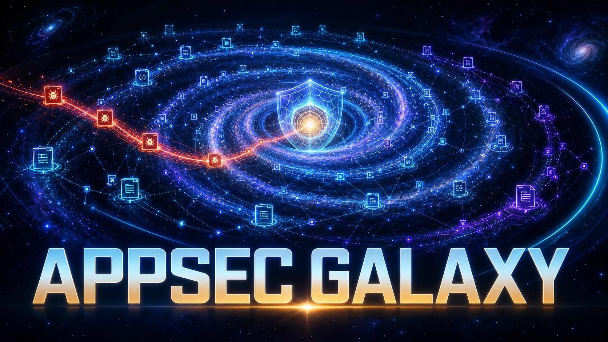

# AppSec Galaxy

**Application security, mapped.**

[](https://github.com/cparnin/appsec-galaxy/actions/workflows/tests.yml)
[](https://github.com/cparnin/appsec-galaxy/actions/workflows/self-scan.yml)
[](LICENSE)

AppSec Galaxy combines rule-based application security scanners with optional
AI analysis (OpenAI or Anthropic) to map findings across files, identify attack
chains, generate reports and SBOMs, and propose tightly constrained single-line
remediations.

**We dogfood it.** AppSec Galaxy scans its own code on every push and runs a
weekly AI deep scan ([self-scan.yml](.github/workflows/self-scan.yml)); the
Self-Scan badge above reflects the latest run. The same untrusted-input
hardening it enforces on your repos (no lockfile scripts on hostile code, no
auto-fix on untrusted PRs, allowlisted scan paths) it applies to itself.

## What it includes

- Semgrep SAST, Gitleaks secret detection, and Trivy dependency plus IaC/config
  misconfiguration scanning (Terraform, CloudFormation, Kubernetes, Dockerfile).
- Secret findings carry an offline confidence score (entropy + placeholder
  heuristics) so test fixtures and template values sort below real credentials.
- Language-specific code-quality adapters for common ecosystems.
- Cross-file correlation, attack-chain analysis, trend history, diff scoping,
  and baseline suppression.
- Dependency CVEs ranked by real risk: EPSS exploit probability and CISA KEV
  membership combined with code reachability (a CVE in a dep your code never
  imports is de-escalated; an exploited CVE in a dep you actually call rises
  to the top).
- Optional AI-native analysis: OpenAI (Responses API) or Anthropic (Messages API).
- HTML and SARIF reports plus CycloneDX and SPDX SBOM output. SARIF carries
  GitHub Code Scanning severity ranking and cross-run alert fingerprints.
- CLI, local web interface, GitHub Action, and a 16-tool FastMCP server.

AI is opt-in. Rule-based scanning works without any AI key.

## Quick start

Requirements: Python 3.11-3.13, plus the external scanners (Gitleaks for
secrets, Trivy for dependencies/IaC, Syft for SBOMs):

```bash
# macOS
brew install gitleaks trivy syft

# Linux (or see each project's releases page)
# gitleaks: https://github.com/gitleaks/gitleaks/releases
# trivy:    https://trivy.dev/latest/getting-started/installation/
# syft:     https://github.com/anchore/syft/releases
```

```bash
git clone https://github.com/cparnin/appsec-galaxy.git
cd appsec-galaxy
python3 -m venv .venv    # any Python 3.11-3.13
.venv/bin/python -m pip install -e ".[web,dev]"
cp env.example .env
```

For optional AI scanning, edit `.env` and set:

```dotenv
AI_PROVIDER=openai                          # or: anthropic
OPENAI_API_KEY=your-openai-api-key-here     # ANTHROPIC_API_KEY when AI_PROVIDER=anthropic
APPSEC_AI_SCAN=true
APPSEC_AI_SCAN_DEPTH=standard
```

Start the CLI:

```bash
.venv/bin/appsec-galaxy
```

Or start the local web interface:

```bash
./start_web.sh
```

## AI provider configuration

AppSec Galaxy supports `AI_PROVIDER=openai` (the default -- blank or unset
values resolve to OpenAI) and `AI_PROVIDER=anthropic`. The interactive CLI
shows a provider picker whenever AI features are enabled, verifies the matching
API key is set (`OPENAI_API_KEY` or `ANTHROPIC_API_KEY`), and runs a one-token
test call so misconfiguration fails before a scan starts, with a clear message.

The default scan-depth mapping per provider is:

| Depth | OpenAI | Anthropic |
| --- | --- | --- |
| `quick` | `gpt-5.6-luna` | `claude-haiku-4-5` |
| `standard` | `gpt-5.6-terra` | `claude-sonnet-5` |
| `deep` | `gpt-5.6-sol` | `claude-opus-4-8` |

`APPSEC_AI_SCAN_MODEL` overrides scanner requests. `AI_MODEL` is the broader
fallback override. Static findings and reports remain available if optional AI
enrichment fails.

## Outputs

Each scanned repository receives one current output directory:

```text
outputs/<repository>/
├── raw/                 # scanner-native JSON
├── sbom/                # CycloneDX and SPDX artifacts
├── report.html
├── report.sarif
└── history.json         # new/fixed trend data
```

Raw scanner output can contain sensitive findings. The output directory is
ignored by Git, and stale repository outputs are purged according to
`APPSEC_OUTPUT_RETENTION_DAYS`.

## Baselines and PR scoping

Create `.appsec-galaxy-ignore` in the scanned repository to suppress accepted
findings. Each non-comment line is `tool:rule:path-glob`; wildcards are
supported.

```text
gitleaks:generic-api-key:tests/fixtures/*
semgrep:*sql-injection*:legacy/*
trivy:CVE-2024-1234:*
```

Set `APPSEC_DIFF_ONLY=true` to keep findings only in files changed from
`APPSEC_DIFF_BASE` (default `origin/main`, with `origin/master` fallback).
Both filters fail open so configuration errors do not hide findings.

## MCP

The FastMCP server supports ChatGPT desktop, Codex, and other MCP clients:

```toml
[mcp_servers.appsec-galaxy]
command = ".venv/bin/python"
args = ["mcp/appsec_galaxy_mcp_server.py"]
```

Set credentials in the server process environment; never embed them in MCP
configuration. See [mcp/README.md](mcp/README.md) for tool, resource, and
client setup details. Claude Desktop is supported as an optional compatible
MCP client.

## GitHub Action

The reusable action accepts `ai-provider` (`openai` default, or `anthropic`),
`openai-api-key`, `anthropic-api-key`, and optional `ai-model` inputs.
The drop-in workflow is in [clients/security-scan.yml](clients/security-scan.yml),
with setup instructions in [clients/SETUP.md](clients/SETUP.md).

## Development

```bash
.venv/bin/python -m ruff check src/ mcp/ scripts/ tests/
.venv/bin/python -m mypy src/appsec_galaxy mcp scripts tests
PYTHON_DOTENV_DISABLED=1 .venv/bin/python -m pytest tests/ -v --tb=short
```

Architecture and security invariants are documented in
[ARCHITECTURE.md](ARCHITECTURE.md). Contributor and agent rules are in
[AGENTS.md](AGENTS.md).

## License

MIT. See [LICENSE](LICENSE).
