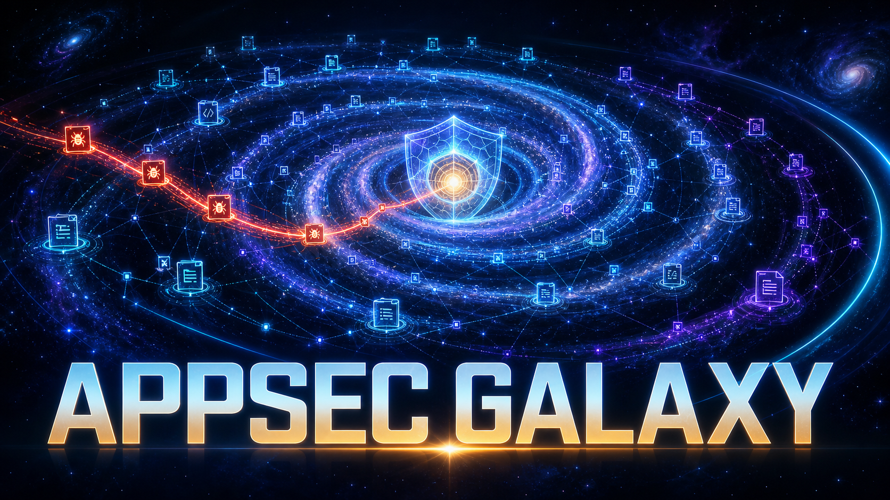

# AppSec Galaxy

**Application security, mapped.**

[](https://github.com/cparnin/appsec-galaxy/actions/workflows/tests.yml)
[](https://github.com/cparnin/appsec-galaxy/actions/workflows/self-scan.yml)
[](LICENSE)

AppSec Galaxy combines rule-based application security scanners with optional
AI analysis (Anthropic or OpenAI) to map findings across files, identify attack
chains, generate reports and SBOMs, and propose tightly constrained single-line
remediations.

## Quick start

Requirements: Python 3.11-3.13, plus the external scanners (Gitleaks for
secrets, Trivy for dependencies/IaC, Syft for SBOMs):

```bash
# macOS
brew install gitleaks trivy syft

# Linux (or see each project's releases page)
# gitleaks: https://github.com/gitleaks/gitleaks/releases
# trivy:    https://trivy.dev/latest/getting-started/installation/
# syft:     https://github.com/anchore/syft/releases
```

```bash
git clone https://github.com/cparnin/appsec-galaxy.git
cd appsec-galaxy
python3 -m venv .venv    # any Python 3.11-3.13
.venv/bin/python -m pip install -e ".[web,dev]"
cp env.example .env
```

For optional AI scanning, edit `.env` and set:

```dotenv
AI_PROVIDER=anthropic                            # default; or: openai
ANTHROPIC_API_KEY=your-anthropic-api-key-here    # OPENAI_API_KEY when AI_PROVIDER=openai
APPSEC_AI_SCAN=true
APPSEC_AI_SCAN_DEPTH=standard
```

Start the CLI:

```bash
.venv/bin/appsec-galaxy
```

It walks you through it: pick a repository, pick which scanners to run, pick a
severity level (and an AI provider and privacy tier if AI is on), then it
scans and writes an HTML report you can open.

Or start the local web interface:

```bash
./start_web.sh
```

## What it includes

- Semgrep SAST, Gitleaks secret detection, and Trivy dependency plus IaC/config
  misconfiguration scanning (Terraform, CloudFormation, Kubernetes, Dockerfile).
- Secret findings carry an offline confidence score (entropy + placeholder
  heuristics).
- Six code-quality linters: ESLint (JavaScript and TypeScript), Pylint,
  Checkstyle (Java), golangci-lint (Go), RuboCop, and SwiftLint.
- Cross-file correlation, attack-chain analysis, trend history, diff scoping,
  and baseline suppression.
- Dependency CVEs ranked by real risk: EPSS exploit probability and CISA KEV
  membership combined with code reachability (a CVE in a dep your code never
  imports is de-escalated; an exploited CVE in a dep you actually call rises
  to the top).
- Optional AI-native analysis: Anthropic (Messages API) or OpenAI (Responses API).
- HTML and SARIF reports plus CycloneDX and SPDX SBOM output. SARIF carries
  GitHub Code Scanning severity ranking and cross-run alert fingerprints.
- CLI, local web interface, GitHub Action, and a 16-tool FastMCP server.

AI is opt-in. Rule-based scanning works without any AI key.

Findings that span files are traced into attack chains, from the entry point
that takes user input to the sink that uses it.

## AI provider configuration

AppSec Galaxy supports `AI_PROVIDER=anthropic` (default) and `AI_PROVIDER=openai`. The interactive CLI
shows a provider picker whenever AI features are enabled, verifies the matching
API key is set, and runs a one-token test call so misconfiguration fails before a scan starts, with a clear message.
The web UI runs the same test at scan start and re-reads a key you rotate in `.env` without a server restart.

The default scan-depth mapping per provider is:

| Depth | OpenAI | Anthropic |
| --- | --- | --- |
| `quick` | `gpt-5.6-luna` | `claude-haiku-4-5` |
| `standard` | `gpt-5.6-terra` | `claude-sonnet-5` |
| `deep` | `gpt-5.6-sol` | `claude-opus-4-8` |

`APPSEC_AI_SCAN_MODEL` overrides scanner requests. `AI_MODEL` is the broader
fallback override. Static findings and reports remain available if optional AI
enrichment fails.

### What data reaches the AI provider

Once AI is enabled, `APPSEC_AI_SCAN_TIER` controls exposure:

| Tier | What leaves your machine |
| --- | --- |
| `1` | Nothing. Every AI call is gated off. |
| `2` | Finding metadata only: file paths, line numbers, rule IDs, and scanner messages for the top 15 findings, used to write the executive summary. No source files. |
| `3` (default) | Source files (capped by `APPSEC_AI_SCAN_MAX_FILES`, default 50) plus the above. |

The same threshold gates auto-remediation: AI code fixes send the vulnerable
line plus context, so they require tier 3 and are skipped below it.
Dependency version bumps never call the AI and work at every tier.

Detected secret values are excluded from AI prompts at every tier; Gitleaks
findings are summarized by type only. Set the tier per run in the CLI picker
or the web UI's AI Data Privacy dropdown, per repository with the Action's
`ai-scan-tier` input, or persistently via `APPSEC_AI_SCAN_TIER` in `.env`.

AI spend is visible and cappable: every scan prints token usage and estimated
USD, and `APPSEC_AI_SCAN_MAX_COST` (or the Action's `ai-scan-max-cost` input)
is a hard ceiling; the scan stops issuing AI calls once it is reached. With
`APPSEC_DIFF_ONLY=true`, the AI scanner analyzes only the files changed vs the
base ref, which makes per-PR AI scans cost cents instead of a full-repo pass.

## Network calls

Your source code never leaves the machine unless you turn on AI analysis.
Semgrep, Gitleaks, and Trivy all run locally. Three features do make outbound
calls, none of them carrying source:

| Feature | What it sends | Turn it off with |
| --- | --- | --- |
| Exploit intelligence (EPSS, CISA KEV) | CVE IDs | `APPSEC_VULN_INTEL=false` |
| Dependency health | package names | `APPSEC_DEP_HEALTH_CHECK=false` |
| Semgrep rulesets | nothing; downloads `p/default` | `APPSEC_SEMGREP_CONFIG` (a local path) |

## Outputs

Each scanned repository receives one current output directory:

```text
outputs/<repository>/
├── raw/                 # scanner-native JSON
├── sbom/                # CycloneDX and SPDX artifacts
├── report.html
├── report.sarif
└── history.json         # new/fixed trend data
```

Raw scanner output can contain sensitive findings. The output directory is
ignored by Git, and stale repository outputs are purged according to
`APPSEC_OUTPUT_RETENTION_DAYS`.

## Baselines and PR scoping

Create `.appsec-galaxy-ignore` in the scanned repository to suppress accepted
findings. Each non-comment line is `tool:rule:path-glob`; wildcards are
supported.

```text
gitleaks:generic-api-key:tests/fixtures/*
semgrep:*sql-injection*:legacy/*
trivy:CVE-2024-1234:*
```

Set `APPSEC_DIFF_ONLY=true` to keep findings only in files changed from
`APPSEC_DIFF_BASE` (default `origin/main`, with `origin/master` fallback).
The AI scanner honors the same scope, analyzing only changed files. Both
filters fail open so configuration errors do not hide findings.

## MCP server (use it from an AI client)

The FastMCP server works with any MCP client (Codex, Claude Desktop, ChatGPT desktop):

```toml
[mcp_servers.appsec-galaxy]
command = ".venv/bin/python"
args = ["mcp/appsec_galaxy_mcp_server.py"]
```

Set credentials in the server process environment; never embed them in MCP
configuration. See [mcp/README.md](mcp/README.md) for tool, resource, and
client setup details.

## GitHub Action

The reusable action's inputs include `ai-provider` (`anthropic` default, or
`openai`), the matching API key, `scan-level`, `auto-fix`, `ai-scan-tier`,
and `fail-on-critical`; [action.yml](action.yml) documents all of them.
The drop-in workflow is in [clients/security-scan.yml](clients/security-scan.yml),
with setup instructions in [clients/SETUP.md](clients/SETUP.md).

## Development

```bash
.venv/bin/python -m ruff check src/ mcp/ scripts/ tests/
.venv/bin/python -m mypy src/appsec_galaxy mcp scripts tests
PYTHON_DOTENV_DISABLED=1 .venv/bin/python -m pytest tests/ -q
```

Architecture and security invariants are documented in
[ARCHITECTURE.md](ARCHITECTURE.md). Contributor and agent rules are in
[AGENTS.md](AGENTS.md). Release notes are in [CHANGELOG.md](CHANGELOG.md).

AppSec Galaxy scans its own code with the rule-based scanners on every push
and pull request to `main` ([self-scan.yml](.github/workflows/self-scan.yml)),
with no AI calls or API spend in CI. The Self-Scan badge at the top reflects
the latest run.

## License

MIT. See [LICENSE](LICENSE).

---

Built by [Chad Parnin](https://chadparnin.com).
